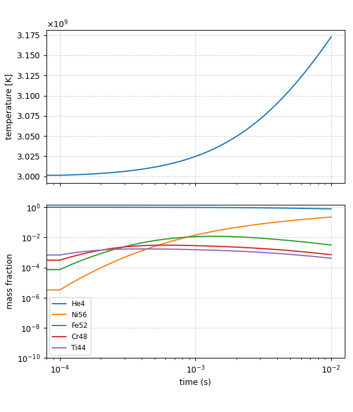

.. _sec:burn_cell:

*************
``burn_cell``
*************

.. index:: burn_cell

``burn_cell`` is a simple one-zone burn that will evolve a state with
a network for a specified amount of time.  This can be used to
understand the timescales involved in a reaction sequence or to
determine the needed ODE tolerances.  This is designed to work
with the Strang-split integration wrappers.  The system that is evolved
has the form:

.. math::

   \begin{align*}
      \frac{dX_k}{dt} &= \dot{\omega}_k(\rho, X_k, T) \\
      \frac{de}{dt} &= \epsilon(\rho, X_k, T)
   \end{align*}

with density held constant and the temperature found via the equation of state,
$T = T(\rho, X_k, e)$.

.. note::

   Since the energy evolves due to the heat release (or loss)
   from reactions, the temperature will change during the burn
   (unless ``integrator.call_eos_in_rhs=0`` is set).

Getting Started
===============

The ``burn_cell`` code is located in
``Microphysics/unit_test/burn_cell``.  An inputs file which sets the
default parameters for your choice of network is needed to run the
test.  There are a number of inputs files in the unit test directory
already with a name list ``inputs_network``, where ``network``
is the network you wish to use for your testing.  These can be
used as a starting point for any explorations.

Setting the thermodynamics
--------------------------

The parameters that affect the thermodynamics are:

* ``unit_test.density`` : the initial density

* ``unit_test.temperature`` : the initial temperature

The composition can be set either by specifying individual mass fractions
or setting ``unit_test.uniform_xn`` as described in :ref:`sec:defining_unit_test_composition`.

If the values don't sum to ``1`` initially, then the test will do a
normalization.  This normalization can be disabled by setting:

::

    unit_test.skip_initial_normalization = 1

.. _sec:burn_cell_time:

Controlling time
----------------

The test will run unit a time ``unit_test.tmax``, outputting the state
at regular intervals.  The parameters controlling the output are:

* ``unit_test.tmax`` : the end point of integration.

* ``unit_test.tfirst`` : the first time interval to output.

* ``unit_test.nsteps`` : the number of steps to divide the integration into,
  logarithmically-spaced.

If there is only a single step, ``unit_test.nsteps = 1``, then we integrate
from $[0, \mathrm{tmax}]$.

If there are multiple steps, then the first output will be at a time
$\mathrm{tmax} / \mathrm{nsteps}$, and the steps will be
logarithmically-spaced afterwards.

Integration parameters
----------------------

The tolerances, choice of Jacobian, and other integration parameters
can be set via the usual Microphysics runtime parameters, e.g.
``integrator.atol_spec``.

Building and Running the Code
=============================

The code can be built simply as:

.. prompt:: bash

   make

and the network and integrator can be changed using the normal
Microphysics build system parameters, e.g.,

.. prompt:: bash

   make NETWORK_DIR=aprox19 INTEGRATOR_DIR=rkc

The build process will automatically create links in the build
directory to the EOS table and any reaction rate tables needed by your
choice of network.

.. important::

   You need to do a ``make clean`` before rebuilding with a different
   network or integrator.

To run the code, in the ``burn_cell`` directory run::

   ./main3d.gnu.ex inputs

where ``inputs`` is the name of your inputs file.

Working with Output
===================

.. note::

   For this part, we'll assume that the default ``aprox13`` and
   ``VODE`` options were used for the network and integrator, and the
   test was run with ``inputs.aprox13``.

As the code runs, it will output to ``stdout`` details of the initial
and final state and the number of integration steps taken (along with whether
the burn was successful).  The full history of the thermodynamic state will also be output to a file,
``state_over_time.txt``, with each line corresponding to one of the
``nsteps`` requested in the time integration.

The script ``plot_burn_cell.py`` can be used to visualize the evolution:

.. prompt:: bash

   python plot_burn_cell.py state_over_time.txt

This will generate the following figure:

Only the most abundant species are plotted.  The number of species to plot and the
limits of $X$ can be set via runtime parameters (see ``python plot_burn_cell.py -h``).
