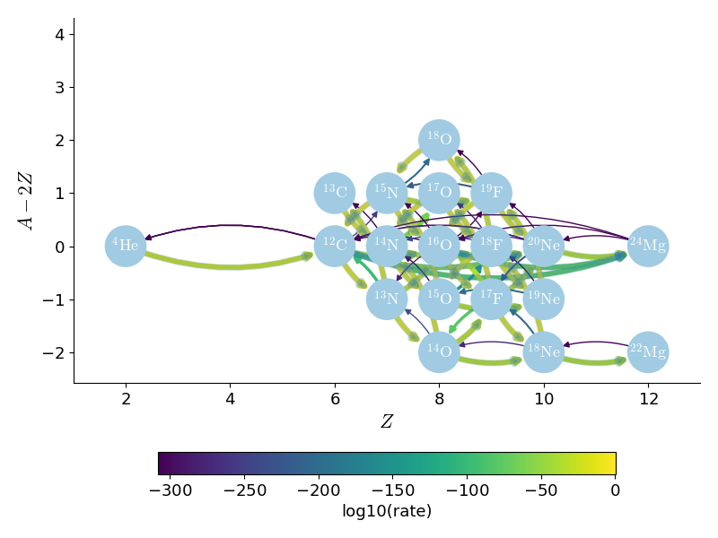
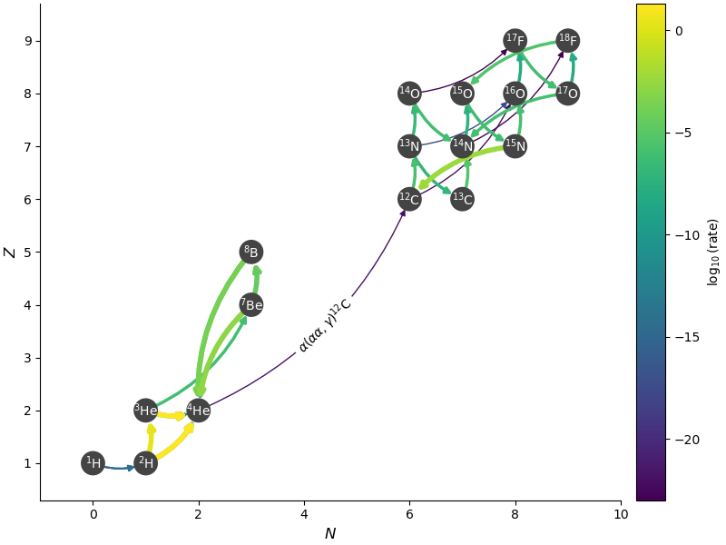
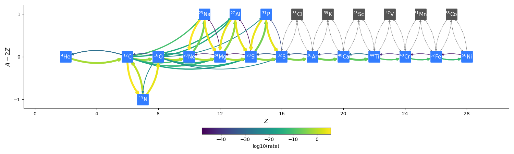
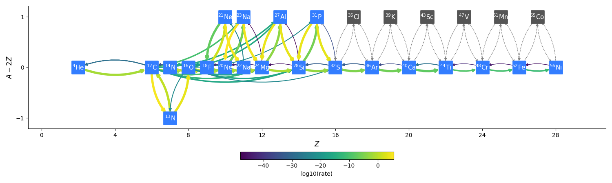
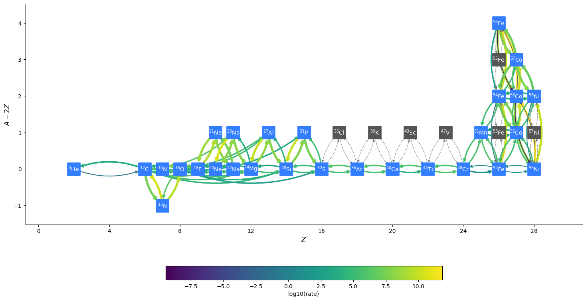
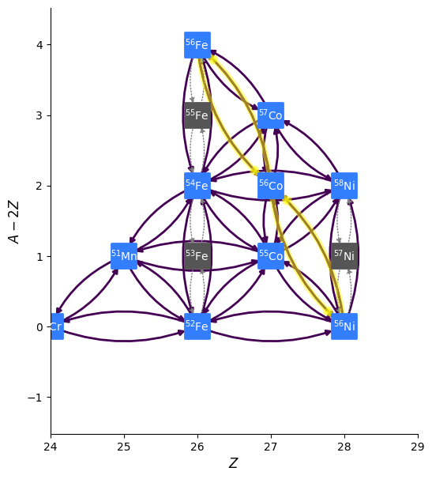
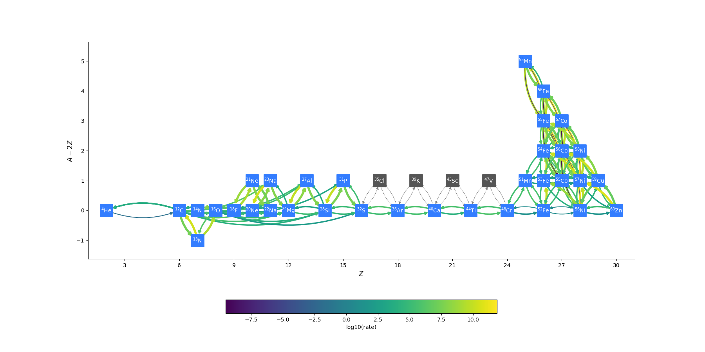
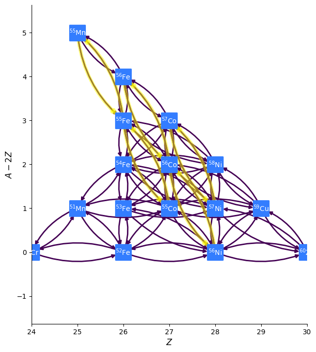
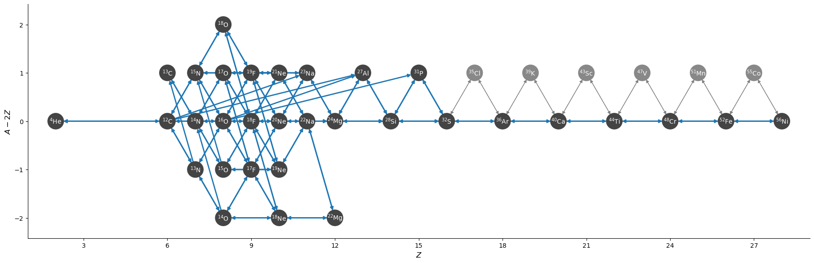
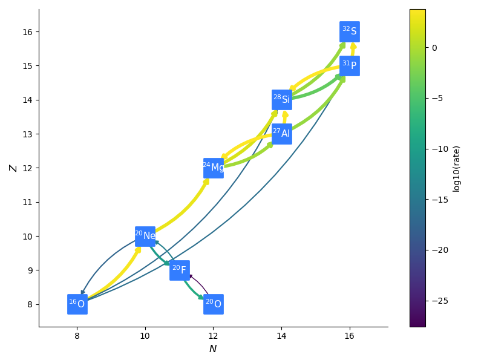

.. _sec:networks:

***************************
Available Reaction Networks
***************************

A network defines the composition, which is needed by the equation
of state and transport coefficient routines.  Even if there are no
reactions taking place, a network still needs to be defined, so
Microphysics knows the properties of the fluid.

.. index:: NETWORK_DIR

.. note::

   The network is set at compile-time via the ``NETWORK_DIR``
   make variable.

.. tip::

   If reactions can be ignored, then the ``general_null`` network can
   be used --- this simply defines a composition with no reactions.

.. note::

   Many of the networks here are generated using `pynucastro
   <https://pynucastro.github.io/>`_ :cite:`pynucastro, pynucastro2` using the ``AmrexAstroCxxNetwork``
   class.

.. _sec:networks:general_null:

``general_null``
================

.. index:: general_null

``general_null`` is a bare interface for a nuclear reaction network ---
no reactions are enabled. The
data in the network is defined at compile type by specifying an
inputs file. For example,
``networks/general_null/triple_alpha_plus_o.net`` would describe the
triple-:math:`\alpha` reaction converting helium into carbon, as
well as oxygen and iron.  This has the form:

.. code::

    # name       short name    aion     zion
    helium-4       He4          4.0      2.0
    carbon-12      C12         12.0      6.0
    oxygen-16      O16         16.0      8.0
    iron-56        Fe56        56.0     26.0

The four columns give the long name of the species, the short form that will be used
for plotfile variables, and the mass number, :math:`A`, and proton number, :math:`Z`.

The name of the inputs file by one of two make variables:

.. index:: NETWORK_INPUTS, GENERAL_NET_INPUTS

* ``NETWORK_INPUTS`` : this is simply the name of the "`.net`" file, without
  any path.  The build system will look for it in the current directory
  and then in ``$(MICROPHYSICS_HOME)/networks/general_null/``.

  For the example above, we would set:

  ::

    NETWORK_INPUTS := triple_alpha_plus_o.net

* ``GENERAL_NET_INPUTS`` : this is the full path to the file.  For example
  we could set:

  ::

    GENERAL_NET_INPUTS := /path/to/file/triple_alpha_plus_o.net

.. index:: network_properties.H

At compile time, the "`.net`" file is parsed and a network header
``network_properties.H`` is written using the python script
``write_network.py``.  The make rule for this is contained in
``Microphysics/networks/Make.package``.

``iso7``, ``aprox13``, ``aprox19``, and ``aprox21``
===================================================

These are alpha-chains (with some other nuclei) based on the `original
Fortran networks from Frank Timmes
<https://cococubed.com/code_pages/burn_helium.shtml>`_.  These
networks share common rates from ``Microphysics/rates`` and are
implemented using the templated C++ network infrastructure.

These networks approximate a lot of the links, in particular,
combining $(\alpha, p)(p, \gamma)$ and $(\alpha, \gamma)$ into a
single effective rate.

The available networks are:

* ``iso7`` : contains $\isotm{He}{4}$, $\isotm{C}{12}$,
  $\isotm{O}{16}$, $\isotm{Ne}{20}$, $\isotm{Mg}{24}$, $\isotm{Si}{28}$,
  $\isotm{Ni}{56}$ and is based on :cite:`iso7`.

* ``aprox13`` : adds $\isotm{S}{32}$, $\isotm{Ar}{36}$, $\isotm{Ca}{40}$, $\isotm{Ti}{44}$, $\isotm{Cr}{48}$, $\isotm{Fe}{52}$

* ``aprox19`` : adds $\isotm{H}{1}$, $\isotm{He}{3}$, $\isotm{N}{14}$, $\isotm{Fe}{54}$,
  $\mathrm{p}$, $\mathrm{n}$.  Here, $\mathrm{p}$ participates only in the photodisintegration rates at high mass number, and is distinct from $\isotm{H}{1}$.

* ``aprox21`` : adds $\isotm{Cr}{56}$, $\isotm{Fe}{56}$.  This is designed to reach
  a lower $Y_e$ than the other networks, for use in massive star simulations.  Note
  that the link to $\isotm{Cr}{56}$ is greatly approximated.

These networks store the total binding energy of the nucleus in MeV as
``bion(:)``. They then compute the mass of each nucleus in grams as:

.. math:: M_k = (A_k - Z_k) m_n + Z_k (m_p + m_e) - B_k

where :math:`m_n`, :math:`m_p`, and :math:`m_e` are the neutron, proton, and electron
masses, :math:`A_k` and :math:`Z_k` are the atomic weight and number, and :math:`B_k`
is the binding energy of the nucleus (converted to grams). :math:`M_k`
is stored as ``mion(:)`` in the network.

The energy release per gram is converted from the rates as:

.. math:: \epsilon = -N_A c^2 \sum_k \frac{dY_k}{dt} M_k - \epsilon_\nu

where :math:`N_A` is Avogadro’s number (to convert this to “per gram”)
and :math:`\epsilon_\nu` is the neutrino loss term (see :ref:`neutrino_loss`).

``CNO_extras``
==============

This network replicates the popular `MESA "cno_extras"
network <https://docs.mesastar.org/en/latest/net/nets.html>`_ which is
meant to study hot-CNO burning and the start of the breakout from CNO
burning.  This network is managed by pynucastro.

.. note::

   We add ${}^{56}\mathrm{Fe}$ as an inert nucleus to allow this to be
   used for X-ray burst simulations (not shown in the network diagram
   above).

The ``nova`` network:
=====================

This network is composed of 17 nuclei: $\isotm{H}{1,2}$, $\isotm{He}{3,4}$, $\isotm{Be}{7}$, $\isotm{B}{8}$,
$\isotm{C}{12,13}$, $\isotm{N}{13-15}$, $\isotm{O}{14-17}$, $\isotm{F}{17,18}$ and is used to model the onset of
a classical novae thermonuclear runaway. The first set of nuclei, $\isotm{H}{1,2}$, $\isotm{He}{3,4}$ represent
the pp-chain sector of the reaction network, while the second set, of $\isotm{Be}{7}$, and $\isotm{B}{8}$, describe
the involvement of the x-process. Finally, all the remaining nuclei are active participants of
the CNO cycle with endpoints at $\isotm{F}{17}$ and $\isotm{F}{18}$. The triple-$\alpha$ reaction
$\alpha(\alpha\alpha,\gamma)\isotm{C}{12}$, serves as bridge between the nuclei of first and the last set.

The the cold-CNO chain of reactions of the CN-branch are:

* :math:`\isotm{C}{12}(p,\gamma)\isotm{N}{13}(\beta^{+}\nu_e)\isotm{C}{13}(p,\gamma)`

while the NO-branch chain of reactions is:

* :math:`\isotm{N}{14}(p,\gamma)\isotm{O}{15}(\beta^{+})\isotm{N}{15}(p,\gamma)\isotm{O}{16}(p,\gamma)\isotm{F}{17}(\beta^{+}\nu_e)\isotm{O}{17}`

where the isotopes $\isotm{N}{15}$ and $\isotm{O}{17}$ may decay back into $\isotm{C}{12}$ and $\isotm{N}{14}$ through
$\isotm{N}{15}(p,\alpha)\isotm{C}{12}$ and $\isotm{O}{17}(p,\alpha)\isotm{N}{14}$ respectively.

Once the temperature reaches a threshold of $\gtrsim 10^8\,\mathrm{K}$, the fast $p$-captures, for example,
$\isotm{N}{13}(p,\gamma)\isotm{O}{14}$, are more likely than the $\beta^{+}$-decays $\isotm{N}{13}(\beta^{+}\nu_e)\isotm{C}{13}$
reactions. These rates are also included in this network.

He-burning networks
===================

This is a collection of networks meant to model He burning.  The are inspired by the
"aprox"-family of networks, but contain more nuclei/rates, and are managed by
pynucastro.

One feature of these networks is that they include a bypass rate for
:math:`\isotm{C}{12}(\alpha, \gamma)\isotm{O}{16}` discussed in
:cite:`ShenBildsten`.  This is appropriate for explosive He burning.
That paper discusses the sequences:

* :math:`\isotm{C}{14}(\alpha, \gamma)\isotm{O}{18}(\alpha,
  \gamma)\isotm{Ne}{22}` at high temperatures (T > 1 GK).  We don't
  consider this.

* :math:`\isotm{N}{14}(\alpha, \gamma)\isotm{F}{18}(\alpha,
  p)\isotm{Ne}{21}` is the one they consider important, since it produces
  protons that are then available for :math:`\isotm{C}{12}(p,
  \gamma)\isotm{N}{13}(\alpha, p)\isotm{O}{16}`.

This leaves :math:`\isotm{Ne}{21}` as an endpoint, which we connect to
the other nuclei by including :math:`\isotm{Na}{22}`.

For the :math:`\isotm{C}{12} + \isotm{C}{12}`, :math:`\isotm{C}{12} +
\isotm{O}{16}`, and :math:`\isotm{O}{16} + \isotm{O}{16}` rates, we
also need to include:

* :math:`\isotm{C}{12}(\isotm{C}{12},n)\isotm{Mg}{23}(n,\gamma)\isotm{Mg}{24}`

* :math:`\isotm{O}{16}(\isotm{O}{16}, n)\isotm{S}{31}(n, \gamma)\isotm{S}{32}`

* :math:`\isotm{O}{16}(\isotm{C}{12}, n)\isotm{Si}{27}(n, \gamma)\isotm{Si}{28}`

Since the neutron captures on those
intermediate nuclei are so fast, we leave those out and take the
forward rate to just be the first rate.  We do not include reverse
rates for these processes.

These networks also combine some of the
:math:`A(\alpha,p)X(p,\gamma)B` links with :math:`A(\alpha,\gamma)B`,
allowing us to drop the intermediate nucleus :math:`X`.  Some will
approximate $A(n,\gamma)X(n,\gamma)B$ into an effective
$A(nn,\gamma)B$ rate (double-neutron capture).

The networks are named with a descriptive name, the number of nuclei,
and the letter ``a`` if they approximate $(\alpha, p)(p,\gamma)$,
the letter ``n`` if they approximate double-neutron capture, and the
letter ``p`` if they split the protons into two groups (one for
photo-disintegration).

``he-burn-18a``
---------------

.. note::

   This network was previously called ``subch_base``.

This is the simplest network and is similar to ``aprox13``, but includes
a better description of $\isotm{C}{12}$ and $\isotm{O}{16}$ burning, as
well as the bypass rate for $\isotm{C}{12}(\alpha,\gamma)\isotm{O}{16}$.

It has the following features / simplifications:

* $\isotm{Cl}{35}$, $\isotm{K}{39}$, $\isotm{Sc}{43}$,
  $\isotm{V}{47}$, $\isotm{Mn}{51}$, and $\isotm{Co}{55}$ are approximated
  out of the $(\alpha, p)(p, \gamma)$ links.

* The nuclei :math:`\isotm{N}{14}`, :math:`\isotm{F}{18}`,
  :math:`\isotm{Ne}{21}`, and :math:`\isotm{Na}{22}` are not included.
  This means that we do not capture the :math:`\isotm{N}{14}(\alpha,
  \gamma)\isotm{F}{18}(\alpha, p)\isotm{Ne}{21}` rate sequence.

* The reverse rates of :math:`\isotm{C}{12}+\isotm{C}{12}`,
  :math:`\isotm{C}{12}+\isotm{O}{16}`, :math:`\isotm{O}{16}+\isotm{O}{16}` are
  neglected since they're not present in the original aprox13 network

* The :math:`\isotm{C}{12}+\isotm{Ne}{20}` rate is removed

* The :math:`(\alpha, \gamma)` links between :math:`\isotm{Na}{23}`,
  :math:`\isotm{Al}{27}` and between :math:`\isotm{Al}{27}` and
  :math:`\isotm{P}{31}` are removed, since they're not in the
  original aprox13 network.

Overall, there are 18 nuclei and 85 rates.

The network appears as:

The nuclei in gray are those that have been approximated about, but the links
are effectively accounted for in the approximate rates.

There are 2 runtime parameters that can be used
to disable rates:

* ``network.disable_p_c12__n13`` : if set to ``1``, then the rate
  :math:`\isotm{C}{12}(p,\gamma)\isotm{N}{13}` and its inverse are
  disabled.

* ``network.disable_he4_n13__p_o16`` : if set to ``1``, then the rate
  :math:`\isotm{N}{13}(\alpha,p)\isotm{O}{16}` and its inverse are
  disabled.

Together, these parameters allow us to turn off the sequence
:math:`\isotm{C}{12}(p,\gamma)\isotm{N}{13}(\alpha, p)\isotm{O}{16}` that
acts as a bypass for :math:`\isotm{C}{12}(\alpha, \gamma)\isotm{O}{16}`.

``he-burn-22a``
---------------

.. note::

   This network was previously called ``subch_simple``.

This builds on ``he-burn-18a`` by including the
:math:`\isotm{N}{14}(\alpha, \gamma)\isotm{F}{18}(\alpha,
p)\isotm{Ne}{21}` rate sequence, which allows an enhancement to the
:math:`\isotm{C}{12}(p, \gamma)\isotm{N}{13}(\alpha, p)\isotm{O}{16}`
rate due to the additional proton release.

Overall, there are 22 nuclei and 93 rates.

.. warning:: Due to inclusion of the rate sequence,
   ${}^{14}\mathrm{N}(\alpha, \gamma){}^{18}\mathrm{F}(\alpha,
   p){}^{21}\mathrm{Ne}$, there is an artificial end-point at
   ${}^{22}\mathrm{Na}$.

Like ``he-burn-18a``, there are 2 runtime parameters that can disable
the rates for the $\isotm{C}{12}(p,\gamma)\isotm{N}{13}(\alpha,
p)\isotm{O}{16}$ sequence.

``he-burn-31anp``
-----------------

This builds on ``he-burn-22a`` by adding some iron-peak nuclei.  It no longer
approximates out $\isotm{Mn}{51}$ or $\isotm{Co}{55}$, and includes approximations
to double-neutron capture.  Finally, it splits the protons into two groups,
with those participating in reactions with mass numbers > 48 treated as a separate
group (for photo-disintegration reactions).

Overall, there are 31 nuclei and 137 rates, including 6 tabular weak rates.

The iron group here resembles ``aprox21``, but has the addition of stable $\isotm{Ni}{58}$
and doesn't include the approximation to $\isotm{Cr}{56}$.

The full network appears as:

and a zoom-in on the iron group with the weak rates highlighted appears
as:

``he-burn-36a``
---------------

This has the most complete iron-group, with nuclei up to $\isotm{Zn}{60}$ and no approximations
to the neutron captures.  This network can be quite slow.

Overall, there are 36 nuclei and 173 rates, including 12 tabular weak rates.

The full network appears as:

and a zoom in on the iron group with the weak rates highlighted appears
as:

``CNO_He_burn``
---------------

This network is meant to study explosive H and He burning.  It combines
the ``CNO_extras`` network (with the exception of the inert ${}^{56}\mathrm{Fe}$
with the ``he-burn-22a`` network.  This allows it to capture hot-CNO and
He burning.

``ECSN``
========

``ECSN`` is meant to model electron-capture supernovae in O-Ne white dwarfs.
It includes various weak rates that are important to this process.

C-ignition networks
===================

There are a number of networks that have been developed for exploring
carbon burning in near-Chandrasekhar mass which dwarfs.

``ignition_chamulak``
---------------------

This network was introduced in our paper on convection in white dwarfs
as a model of Type Ia supernovae :cite:`wdconvect`. It models
carbon burning in a regime appropriate for a simmering white dwarf,
and captures the effects of a much larger network by setting the ash
state and energetics to the values suggested in :cite:`chamulak:2008`.

The binding energy, :math:`q`, in this
network is interpolated based on the density. It is stored as the
binding energy (ergs/g) *per nucleon*, with a sign convention that
binding energies are negative. The energy generation rate is then:

.. math:: \epsilon = q \frac{dX(\isotm{C}{12})}{dt} = q A_{\isotm{C}{12}} \frac{dY(\isotm{C}{12})}{dt}

(this is positive since both :math:`q` and :math:`dY/dt` are negative)

``ignition_reaclib``
--------------------

This contains several networks designed to model C burning in WDs.  They include:

* ``C-burn-simple`` : a version of ``ignition_simple`` built from
  ReacLib rates.  This just includes the C+C rates and doesn't group
  the endpoints together.

* ``URCA-simple`` : a basic network for modeling convective Urca,
  containing the ${}^{23}\mathrm{Na}$-${}^{23}\mathrm{Ne}$ Urca pair.

* ``URCA-medium`` : a more extensive Urca network than ``URCA-simple``,
  containing more extensive C burning rates.

``ignition_simple``
-------------------

This is the original network used in our white dwarf convection
studies :cite:`lowMach4`. It includes a single-step
:math:`^{12}\mathrm{C}(^{12}\mathrm{C},\gamma)^{24}\mathrm{Mg}` reaction.
The carbon mass fraction equation appears as

.. math::

   \frac{D X(^{12}\mathrm{C})}{Dt} = - \frac{1}{12} \rho X(^{12}\mathrm{C})^2
       f_\mathrm{Coul} \left [N_A \left <\sigma v \right > \right]

where :math:`N_A \left <\sigma v\right>` is evaluated using the reaction
rate from (Caughlan and Fowler 1988). The Coulomb screening factor,
:math:`f_\mathrm{Coul}`, is evaluated using the general routine from the
Kepler stellar evolution code (Weaver 1978), which implements the work
of (Graboske 1973) for weak screening and the work of (Alastuey 1978
and Itoh 1979) for strong screening.

``powerlaw``
============

This is a simple single-step reaction rate.
We will consider only two species, fuel, :math:`f`, and ash, :math:`a`, through
the reaction: :math:`f + f \rightarrow a + \gamma`. Baryon conservation
requires that :math:`A_f = A_a/2`, and charge conservation requires that :math:`Z_f
= Z_a/2`. We take
our reaction rate to be a powerlaw in temperature. The standard way
to write this is in terms of the number densities, in which case we
have

.. math:: \frac{d n_f}{d t} = -2\frac{d n_a}{d t} = -r

with

.. math:: r = r_0 n_X^2 \left( \frac{T}{T_0} \right )^\nu

Here, :math:`r_0` sets the overall rate, with units of
:math:`[\mathrm{cm^3~s^{-1}}]`, :math:`T_0` is a reference temperature scale, and
:math:`\nu` is the temperature exponent, which will play a role in setting
the reaction zone thickness. In terms of mass fractions, :math:`n_f = \rho
X_a / (A_a m_u)`, our rate equation is

.. math::

   \begin{align}
    \frac{dX_f}{dt} &= - \frac{r_0}{m_u} \rho X_f^2 \frac{1}{A_f} \left (\frac{T}{T_0}\right)^\nu \equiv \omegadot_f  \\
    \frac{dX_a}{dt} &= \frac{1}{2}\frac{r_0}{m_u} \rho X_f^2 \frac{A_a}{A_f^2} \left (\frac{T}{T_0}\right)^\nu = \frac{r_0}{m_u} \rho X_f^2 \frac{1}{A_f} \left (\frac{T}{T_0}\right)^\nu
   \end{align}

We define a new rate constant, :math:`\rt` with units of :math:`[\mathrm{s^{-1}}]` as

.. math::

   \rt =  \begin{cases}
     \dfrac{r_0}{m_u A_f} \rho_0 & \text{if $T \ge T_a$} \\[1em]
     0                          & \text{if $T < T_a$}
    \end{cases}

where :math:`\rho_0` is a reference density and :math:`T_a` is an activation
temperature, and then our mass fraction equation is:

.. math:: \frac{dX_f}{dt} = -\rt X_f^2 \left (\frac{\rho}{\rho_0} \right ) \left ( \frac{T}{T_0}\right )^\nu

Finally, for the
energy generation, we take our reaction to release a specific energy,
:math:`[\mathrm{erg~g^{-1}}]`, of :math:`\qburn`, and our energy source is

.. math:: \epsilon = -\qburn \frac{dX_f}{dt}

There are a number of parameters we use to control the constants in
this network. This is one of the few networks that was designed
to work with ``gamma_law`` as the EOS.

``rprox``
=========

This network contains 10 species, approximating hot CNO,
triple-\ :math:`\alpha`, and rp-breakout burning up through :math:`^{56}\mathrm{Ni}`,
using the ideas from :cite:`wallacewoosley:1981`, but with modern
reaction rates from ReacLib :cite:`ReacLib` where available.
This network was used for the X-ray burst studies in
:cite:`xrb:II, xrb:III`, and more details are contained in those papers.

``triple_alpha_plus_cago``
==========================

This is a 2 reaction network for helium burning, capturing the :math:`3`-:math:`\alpha`
reaction and :math:`\isotm{C}{12}(\alpha,\gamma)\isotm{O}{16}`. Additionally,
:math:`^{56}\mathrm{Fe}` is included as an inert species.
