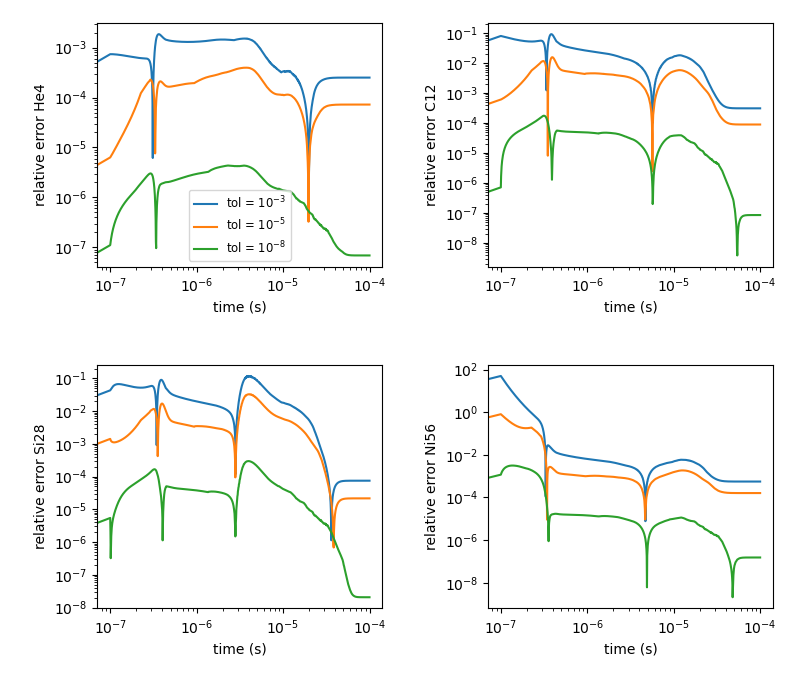

.. _ch:networks:integrators:

***************
ODE Integrators
***************

Available integrators
=====================

We use a high-order implicit ODE solver for integrating the reaction
system.  A few alternatives, including first order implicit and explicit integrators are also
provided.  Internally, the integrators use different data structures
to store the integration progress, and each integrator needs to
provide a routine to convert from the integrator’s internal
representation to the ``burn_t`` type required by the ``actual_rhs``
and ``actual_jac`` routine.

.. index:: INTEGRATOR_DIR

.. note::

   The integrator is chosen at compile-time using
   the ``INTEGRATOR_DIR`` variable in the makefile.

Presently, allowed integrators are:

* ``BackwardEuler``: an implicit first-order accurate backward-Euler
  method.  An error estimate is done by taking 2 half steps and
  comparing to a single full step.  This error is then used to control
  the timestep by using the local truncation error scaling. Optionally, the
  user can disable error estimation and force a single-step backward-Euler
  integration by setting `integrator.do_single_step = 1`.

* ``ForwardEuler``: an explicit first-order forward-Euler method.  This is
  meant for testing purposes only.  No Jacobian is needed.

* ``QSS``: the quasi-steady-state method of :cite:`mott_qss` (see also
  :cite:`guidry_qss`). This uses a second-order predictor-corrector method,
  and is designed specifically for handling coupled ODE systems for chemical
  and nuclear reactions. However, this integrator has difficulty near NSE,
  so we don't recommend its use in production for nuclear astrophysics.

.. index:: integrator.use_circle_theorem

* ``RKC``: a stabilized explicit Runge-Kutta-Chebyshev integrator based
  on :cite:`sommeijer_rkc_1998`.  This does not require a Jacobian, but
  does need to estimate the spectral radius of the system, which is
  done internally.  This works for moderately stiff problems.

  The spectral radius is estimated by default using the power method,
  built into RKC.  Alternately, by setting ``integrator.use_circle_theorem=1``,
  the `Gershgorin circle theorem <https://en.wikipedia.org/wiki/Gershgorin_circle_theorem>`_
  is used instead.

.. index:: integrator.use_jacobian_caching

* ``VODE``: the VODE :cite:`vode` integration package.  We ported this
  integrator to C++ and removed the non-stiff integration code paths.

  .. note::

     The VODE integrator uses Jacobian caching when run on a CPU by default.  This
     can be disabled at runtime by setting ``integrator.use_jacobian_caching = 0``.

     On GPUs, we disable Jacobian caching due to the increased memory
     needs.  Jacobian caching on GPUs can be enabled by explicitly
     setting the build parameter ``USE_JACOBIAN_CACHING=TRUE``.

We recommend that you use the VODE solver, as it is the most
robust.

.. index:: integrator.scale_system

.. note::

   The runtime parameter ``integrator.scale_system``
   will scale the internal energy that the integrator sees by the initial
   value of :math:`e` to make the system :math:`\mathcal{O}(1)`.  The value
   of ``atol_enuc`` will likewise be scaled.  This works for both Strang
   and simplified-SDC.  For the ``RKC`` integrator, this is enabled by
   default.

   For most integrators this algebraic change should not affect the output
   to more than roundoff, but the option is included to allow for some
   different integration approaches in the future.

   This option currently does not work with the ForwardEuler or QSS integrators.

Timestep selection
==================

All of the integrators will select the timestep internally to meet the
tolerances.  There are 2 controls that affect timestepping:

* ``integrator.ode_max_dt`` : sets the maximum allowed timestep

* ``integrator.ode_max_steps`` : sets the maximum number of steps
  the integrator is allowed to take.  If it exceeds this, then
  it will return an error.

Linear algebra
==============

All implicit integrators use the LINPACK LU decomposition routines.

For the templated networks (``aprox13``, ``aprox19``, ...) the implementation
is done using ``consexpr`` loops over the equations and no pivoting is allowed.

.. index:: integrator.linalg_do_pivoting

For the other networks (usually pynucastro networks), the implementation is
provided in ``Microphysics/util/linpack.H`` and is templated on the number
of equations.  Pivoting can be disabled by setting ``integrator.linalg_do_pivoting=0``.

Integration errors
==================

.. important::

   The integrator will not abort if it encounters trouble.  Instead it will
   set ``burn_t burn_state.success = false`` on exit.  It is up to the
   application code to handle the failure.

The ``burn_t`` ``error_code`` field will provide an error code that can be
used to interpret the failure.  The current codes are:

+-------+----------------------------------------------------------+
| code  | meaning                                                  |
+=======+==========================================================+
| 1     | success                                                  |
+-------+----------------------------------------------------------+
| -1    | invalid inputs                                           |
+-------+----------------------------------------------------------+
| -2    | underflow in computing  $\Delta t$                       |
+-------+----------------------------------------------------------+
| -3    | spectral radius estimation did not converge              |
+-------+----------------------------------------------------------+
| -4    | too many steps needed                                    |
+-------+----------------------------------------------------------+
| -5    | unable to meet the accuracy demanded by the tolerances   |
+-------+----------------------------------------------------------+
| -6    | non-convergence in the corrector iteration               |
+-------+----------------------------------------------------------+
| -7    | LU decomposition failed                                  |
+-------+----------------------------------------------------------+
| -100  | entered NSE                                              |
+-------+----------------------------------------------------------+

Tolerances
==========

Tolerances dictate how accurate the ODE solver must be while solving
equations during a simulation.  Typically, the smaller the tolerance
is, the more accurate the results will be.  However, if the tolerance
is too small, the code may run for too long, the ODE solver will
never converge, or it might require at timestep that underflows.

.. index:: integrator.rtol_spec, integrator.rtol_enuc, integrator.atol_spec, integrator.atol_enuc

There are separate tolerances for the mass fractions and the energy,
and there are both relative and absolute tolerances which act together.
The tolerances are:

* ``integrator.rtol_spec`` : the relative tolerance for the species
  (mass fractions when running with Strang and partial densities when
  running with SDC).

* ``integrator.rtol_enuc`` : the relative tolerance on the energy
  (specific internal energy when running with Strang, internal energy
  density when running with SDC).

* ``integrator.atol_spec`` : the absolute tolerance for the species
  (this is always interpreted in terms of mass fraction and the appropriate
  density weighting will be added for SDC).

* ``integrator.atol_enuc`` : the absolute tolerance for energy -- this
  is generally not interesting, since the energy is so large and therefore
  best served via a relative tolerance.

The tolerances are combined, e.g. for species, as:

.. math::

   \epsilon_{\mathrm{total}, k} = \epsilon_\mathrm{abs} + \epsilon_\mathrm{rel} |X_k|

so if the mass fraction, $X_k$, is very small, then the absolute tolerance
will set the error that the integrator tries to achieve.  If the mass fraction
is large, $\mathcal{O}(1)$, then the relative tolerance dominates.

Some suggestions when setting tolerances:

.. index:: integrator.X_reject_buffer

* If a burn does not converge with one type of Jacobian (analytic or
  numerical) then it may do better with the other type.  This can be
  automated via the ``integrator.use_burn_retry`` mechanism described
  above.

* Sometimes a burn completes better if the absolute tolerances are
  made even smaller -- this will require the integrator to track trace
  species better which can help with equilibrium better.

* The VODE integrator has additional logic meant to ensure that
  species don't change too much per timestep.  This is controlled by
  ``integrator.X_reject_buffer``.  If a species $k$, has a mass
  fraction $X_k > \mbox{X_reject_buffer} \cdot \mbox{atol_spec}$ then
  we reject a VODE timestep if the mass fraction changes by more than
  a factor of 4 in a single VODE timestep and we try again.  This is
  all done internally to VODE.  Making ``X_reject_buffer`` larger will
  allow it to ignore more trace species.

Below is a comparison of how the tolerances affect the nucleosynthesis.
This is run using ``burn_cell`` and the ``aprox13`` network.  Four separate
runs were done, using tolerances of $10^{-3}$, $10^{-5}$, $10^{-8}$, and $10^{-12}$
(all 4 tolerance parameters were set to the same value).  The run with the tightest
tolerances ($10^{-12}$) was taken as the reference and relative errors were
computed with respect to it.  The scripts for this are in ``Microphysics/unit_test/burn_cell/compare_tolerances/``.

.. _fig:tolerances:

   Relative error of runs with varying tolerances as compared
   to a run with an ODE tolerance of :math:`10^{-12}`.

We see that using a tolerance of $10^{-5}$ generally gives reasonable mass
fractions.  Looser than this can produce large errors.

Controlling Species $\sum_k X_k = 1$
====================================

.. index:: integrator.renormalize_abundances, integrator.SMALL_X_SAFE, integrator.do_species_clip

The ODE integrators don't know about the constraint that

$$\sum_k X_k = 1$$

so this is only going to be preserved to the level that the integrator
tolerances allow.  There are a few parameters that help enforce this
constraint on the intermediate states during the integration.

* ``integrator.renormalize_abundances`` : this controls whether we
  renormalize the abundances so that the mass fractions sum to one
  during a burn.

  This has the positive benefit that in some cases it can prevent the
  integrator from going off to infinity or otherwise go crazy; a
  possible negative benefit is that it may slow down convergence
  because it interferes with the integration scheme. Regardless of
  whether you enable this, we will always ensure that the mass
  fractions stay positive and larger than some floor ``small_x``.

  This option is disabled by default.

* ``integrator.SMALL_X_SAFE`` : this is the floor on the mass fractions.
  The default is ``1.e-30``.

* ``integrator.do_species_clip`` : this enforces that the mass fractions
  all in $[\mathtt{SMALL\_X\_SAFE}, 1.0]$.

  This is enabled by default.

Retry Mechanism
===============

.. index:: integrator.ode_max_steps

Integration can fail for a number of reasons.  Some of the errors you may see are:

1. Not enough steps allowed (``integrator.ode_max_steps``)

2. The timestep selected by the integrator is too small (comparable to
   roundoff)

3. The final abundances do not sum to 1.

There can be a number of reasons for these failures, including:

* The Jacobian is not accurate enough

  This can lead to issues 1 or 2 above

* The integrator is not appropriate for the thermodynamic conditions

  For example, the RKC integrator may be working too hard, leading to
  issue 1.

* The tolerances you are requesting are too tight

  This can lead to issues 1 or 2 above

* The tolerances (in particular, ``integrator.atol_spec``) are too loose

  This can lead to issue 3 above

* The evolution is entering NSE

  This can lead to issue 1.

The ``integrator()`` function that calls the actual integrator drive for
the choice of integrator allows for a retry if a burn failure was detected.
This is enabled by setting

::

   integrator.use_burn_retry = 1

This will call the same integrator again, restarting from the initial conditions
but with a different choice of tolerances and Jacobian.
The runtime parameters that come into play when doing the retry are:

* ``retry_swap_jacobian`` : do we swap that Jacobian type for the retry (i.e.
  use the numerical Jacobian if we try the analytic Jacobian for the first attempt)

* ``retry_rtol_spec`` : relative tolerance for the species on retry

* ``retry_rtol_enuc`` : relative tolerance for the energy on retry

* ``retry_atol_spec`` : absolute tolerance for the species on retry

* ``retry_atol_enuc`` : absolute tolerance for the energy on retry

.. note::

   If you set any of the retry tolerances to be less than $0$, then
   the original (non-retry) tolerance is used on retry.  The default
   value for all of the retry tolerances is $-1$, which means the same
   tolerances are used on retry unless you override them at runtime.

.. tip::

   Sometimes a simulation runs best if you set
   ``integrator.ode_max_steps`` to a small value (like ``10000``) and
   start with the analytic Jacobian (``integrator.jacobian = 1``) and
   then use the retry mechanism to swap the Jacobian on any zones that fail.
