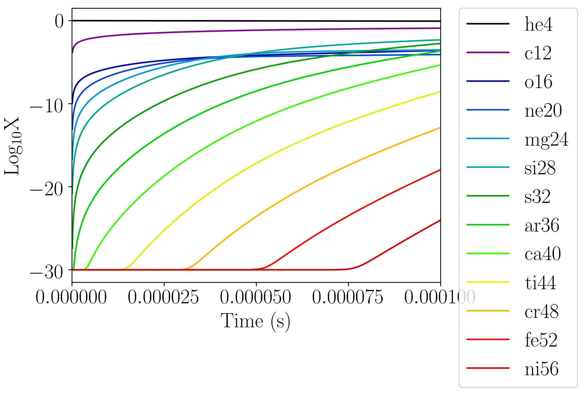

**************
One Zone Tests
**************

There are several tests that let you call the EOS or reaction network
on a single zone to inspect the output directly.

``burn_cell``
=============

.. index:: ``burn_cell``

``burn_cell`` is a simple one-zone burn that will evolve a state with
a network for a specified amount of time.  This can be used to
understand the timescales involved in a reaction sequence or to
determine the needed ODE tolerances.  This is designed to work
with the Strang-split integration wrappers.  The system that is evolved
has the form:

.. math::

   \begin{align*}
      \frac{dX_k}{dt} &= \dot{\omega}_k(\rho, X_k, T) \\
      \frac{de}{dt} &= f(\rho, X_k, T)
   \end{align*}

with density held constant and the temperature found via the equation of state,
$T = T(\rho, X_k, e)$.

Getting Started
---------------

The ``burn_cell`` code are located in
``Microphysics/unit_test/burn_cell``.  An inputs file which sets the
default parameters for your choice of network is needed to run the
test.  There are a number of inputs file in the unit test directory
already with a name list ``inputs_burn_network``, where network
is the network you wish to use for your testing.

Setting the thermodynamics
^^^^^^^^^^^^^^^^^^^^^^^^^^

The parameters that affect the thermodynamics are:

* ``unit_test.density`` : the initial density

* ``unit_test.temperature`` : the initial temperature

* ``unit_test.small_temp`` : the low temperature cutoff used in the equation of state

* ``unit_test.small_dens`` : the low density cutoff used in the equation of state

The composition can be set either by setting each mass fraction explicitly,
e.g.:

::

    unit_test.X1 = 0.5
    unit_test.X2 = 0.2
    unit_test.X3 = 0.2
    unit_test.X4 = 0.1

where parameters up to ``X35`` are available.  If the values don't sum to ``1``
initially, then the test will do a normalization.  This normalization can be
disabled by setting:

::

    unit_test.skip_initial_normalization = 1

Alternately, the composition can be set automatically by initializing all
of the mass fractions equally (to $1/N$, where $N$ is the number of species),
by setting:

::

    unit_test.init_species_all_equal = 1

Controlling time
^^^^^^^^^^^^^^^^

The test will run unit a time ``unit_test.tmax``, outputting the state
at regular intervals.  The parameters controlling the output are:

* ``unit_test.tmax`` : the end point of integration.

* ``unit_test.tfirst`` : the first time interval to output.

* ``unit_test.nsteps`` : the number of steps to divide the integration into,
  logarithmically-spaced.

If there is only a single step, ``unit_test.nsteps = 1``, then we integrate
from $[0, \mathrm{tmax}]$.

If there are multiple steps, then the first output will be at a time
$\mathrm{tmax} / \mathrm{nsteps}$, and the steps will be
logarithmically-spaced afterwards.

Integration parameters
^^^^^^^^^^^^^^^^^^^^^^

The tolerances, choice of Jacobian, and other integration parameters
can be set via the usual Microphysics runtime parameters, e.g.
``integrator.atol_spec``.

Building and Running the Code
-----------------------------

The code can be built simply as:

.. prompt:: bash

   make

and the network and integrator can be changed using the normal
Microphysics build system parameters, e.g.,

.. prompt:: bash

   make NETWORK_DIR=aprox19 INTEGRATOR_DIR=rkc

To run the code, enter the burn_cell directory and run::

   ./main3d.gnu.ex inputs

where ``inputs`` is the name of your inputs file.

For each of the ``numsteps`` steps defined in the inputs
file, the code will output a files into a new directory titled
``run_prefix_output`` where ``run_prefix`` is the run prefix defined in the
inputs file.  Each output file will be named using the run prefix
defined in the inputs file and the corresponding timestep.

Next, run ``burn_cell.py`` using python 3.x, giving the defined run prefix as an argument.
For example::

    python3 burn_cell.py react_aprox13

The ``burn_cell.py`` code will gather information from all of the
output files and compile them into three graphs explained below.

Graphs Output by ``burn_cell.py``
---------------------------------

The file ``run-prefix_logX.png`` and ``run-prefix_logX.eps`` will display a
graph of the chemical abundances as a function of the time, both on
logarithmic scales, for all species involved in the simulation.  An
example of this graph is shown below.

   An example of a plot output by the burn_cell unit test. This is the
   logX output corresponding to the network aprox13.

The file ``run-prefix_ydot.png`` and ``run-prefix_ydot.eps`` will display the
molar fraction (mass fraction / atomic weight) as a function of time,
both on logarithmic scales, for all species involved in the code.

The file ``run-prefix_T-edot.png`` and ``run-prefix_T-edot.eps`` will display
the temperature and the energy generation rate as a function of time.
