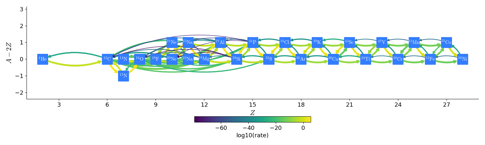
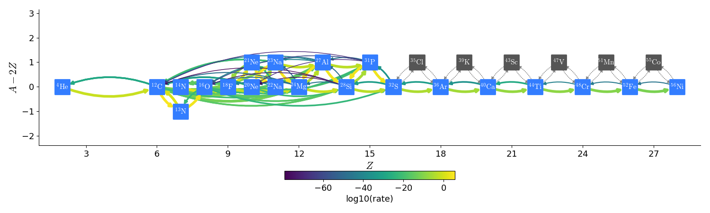
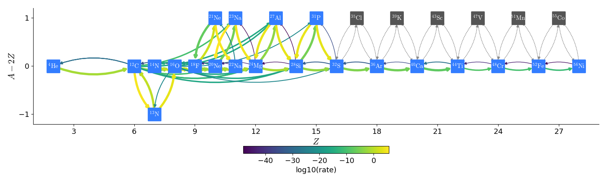
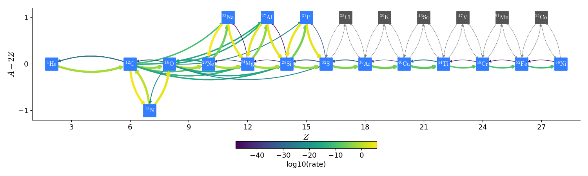

***************************
Available Reaction Networks
***************************

iso7, aprox13, aprox19, and aprox21
===================================

These are alpha-chains (with some other nuclei) from Frank Timmes.
These networks share common rates (from ``Microphysics/rates``),
plasma neutrino loses (from ``Microphysics/neutrinos``), and
electron screening (from ``Microphysics/screening``).

Energy generation.
------------------

These networks store the total binding energy of the nucleus in MeV as
``bion(:)``. They then compute the mass of each nucleus in grams as:

.. math:: M_k = (A_k - Z_k) m_n + Z_k (m_p + m_e) - B_k

where :math:`m_n`, :math:`m_p`, and :math:`m_e` are the neutron, proton, and electron
masses, :math:`A_k` and :math:`Z_k` are the atomic weight and number, and :math:`B_k`
is the binding energy of the nucleus (converted to grams). :math:`M_k`
is stored as ``mion(:)`` in the network.

The energy release per gram is converted from the rates as:

.. math:: \edot = -N_A c^2 \sum_k \frac{dY_k}{dt} M_k - \edotnu

where :math:`N_A` is Avogadro’s number (to convert this to “per gram”)
and :math:`\edotnu` is the neutrino loss term.

general_null
============

``general_null`` is a bare interface for a nuclear reaction network --
no reactions are enabled. The
data in the network is defined at compile type by specifying an
inputs file. For example,
``networks/general_null/triple_alpha_plus_o.net`` would describe the
triple-:math:`\alpha` reaction converting helium into carbon, as
well as oxygen and iron.  This has the form:

.. code::

    # name       short name    aion     zion
    helium-4       He4          4.0      2.0
    carbon-12      C12         12.0      6.0
    oxygen-16      O16         16.0      8.0
    iron-56        Fe56        56.0     26.0

The four columns give the long name of the species, the short form that will be used
for plotfile variables, and the mass number, :math:`A`, and proton number, :math:`Z`.

The name of the inputs file by one of two make variables:

* ``NETWORK_INPUTS`` : this is simply the name of the "`.net`" file, without
  any path.  The build system will look for it in the current directory
  and then in ``$(MICROPHYSICS_HOME)/networks/general_null/``.

  For the example above, we would set:

  ::

    NETWORK_INPUTS := triple_alpha_plus_o.net

* ``GENERAL_NET_INPUTS`` : this is the full path to the file.  For example
  we could set:

  ::

    GENERAL_NET_INPUTS := /path/to/file/triple_alpha_plus_o.net

At compile time, the "`.net`" file is parsed and a network header
``network_properties.H`` is written using the python script
``write_network.py``.  The make rule for this is contained in
``Make.package``.

ignition_chamulak
=================

This network was introduced in our paper on convection in white dwarfs
as a model of Type Ia supernovae :cite:`wdconvect`. It models
carbon burning in a regime appropriate for a simmering white dwarf,
and captures the effects of a much larger network by setting the ash
state and energetics to the values suggested in :cite:`chamulak:2008`.

.. _energy-generation.-1:

Energy generation.
------------------

The binding energy, :math:`q`, in this
network is interpolated based on the density. It is stored as the
binding energy (ergs/g) *per nucleon*, with a sign convention that
binding energies are negative. The energy generation rate is then:

.. math:: \edot = q \frac{dX(\isotm{C}{12})}{dt} = q A_{\isotm{C}{12}} \frac{dY(\isotm{C}{12})}{dt}

(this is positive since both :math:`q` and :math:`dY/dt` are negative)

ignition_reaclib
================

ignition_simple
===============

This is the original network used in our white dwarf convection
studies :cite:`lowMach4`. It includes a single-step
:math:`^{12}\mathrm{C}(^{12}\mathrm{C},\gamma)^{24}\mathrm{Mg}` reaction.
The carbon mass fraction equation appears as

.. math::

   \frac{D X(^{12}\mathrm{C})}{Dt} = - \frac{1}{12} \rho X(^{12}\mathrm{C})^2
       f_\mathrm{Coul} \left [N_A \left <\sigma v \right > \right]

where :math:`N_A \left <\sigma v\right>` is evaluated using the reaction
rate from (Caughlan and Fowler 1988). The Coulomb screening factor,
:math:`f_\mathrm{Coul}`, is evaluated using the general routine from the
Kepler stellar evolution code (Weaver 1978), which implements the work
of (Graboske 1973) for weak screening and the work of (Alastuey 1978
and Itoh 1979) for strong screening.

kpp
===

powerlaw
========

This is a simple single-step reaction rate.
We will consider only two species, fuel, :math:`f`, and ash, :math:`a`, through
the reaction: :math:`f + f \rightarrow a + \gamma`. Baryon conservation
requires that :math:`A_f = A_a/2`, and charge conservation requires that :math:`Z_f
= Z_a/2`. We take
our reaction rate to be a powerlaw in temperature. The standard way
to write this is in terms of the number densities, in which case we
have

.. math:: \frac{d n_f}{d t} = -2\frac{d n_a}{d t} = -r

with

.. math:: r = r_0 n_X^2 \left( \frac{T}{T_0} \right )^\nu

Here, :math:`r_0` sets the overall rate, with units of
:math:`[\mathrm{cm^3~s^{-1}}]`, :math:`T_0` is a reference temperature scale, and
:math:`\nu` is the temperature exponent, which will play a role in setting
the reaction zone thickness. In terms of mass fractions, :math:`n_f = \rho
X_a / (A_a m_u)`, our rate equation is

.. math::

   \begin{align}
    \frac{dX_f}{dt} &= - \frac{r_0}{m_u} \rho X_f^2 \frac{1}{A_f} \left (\frac{T}{T_0}\right)^\nu \equiv \omegadot_f  \\
    \frac{dX_a}{dt} &= \frac{1}{2}\frac{r_0}{m_u} \rho X_f^2 \frac{A_a}{A_f^2} \left (\frac{T}{T_0}\right)^\nu = \frac{r_0}{m_u} \rho X_f^2 \frac{1}{A_f} \left (\frac{T}{T_0}\right)^\nu
   \end{align}

We define a new rate constant, :math:`\rt` with units of :math:`[\mathrm{s^{-1}}]` as

.. math::

   \rt =  \begin{cases}
     \dfrac{r_0}{m_u A_f} \rho_0 & \text{if $T \ge T_a$} \\[1em]
     0                          & \text{if $T < T_a$}
    \end{cases}

where :math:`\rho_0` is a reference density and :math:`T_a` is an activation
temperature, and then our mass fraction equation is:

.. math:: \frac{dX_f}{dt} = -\rt X_f^2 \left (\frac{\rho}{\rho_0} \right ) \left ( \frac{T}{T_0}\right )^\nu

Finally, for the
energy generation, we take our reaction to release a specific energy,
:math:`[\mathrm{erg~g^{-1}}]`, of :math:`\qburn`, and our energy source is

.. math:: \edot = -\qburn \frac{dX_f}{dt}

There are a number of parameters we use to control the constants in
this network. This is one of the few networks that was designed
to work with ``gamma_law`` as the EOS.

rprox
=====

This network contains 10 species, approximating hot CNO,
triple-\ :math:`\alpha`, and rp-breakout burning up through :math:`^{56}\mathrm{Ni}`,
using the ideas from :cite:`wallacewoosley:1981`, but with modern
reaction rates from ReacLib :cite:`ReacLib` where available.
This network was used for the X-ray burst studies in
:cite:`xrb:II`, :cite:`xrb:III`, and more details are contained in those papers.

triple_alpha_plus_cago
======================

This is a 2 reaction network for helium burning, capturing the :math:`3`-:math:`\alpha`
reaction and :math:`\isotm{C}{12}(\alpha,\gamma)\isotm{O}{16}`. Additionally,
:math:`^{56}\mathrm{Fe}` is included as an inert species.

subch networks
==============

The networks subch_full (subch2), subch_approx (subch),
subch_simple, and subch_base recreate an aprox13
alpha-chain + including a bypass rate for :math:`\isotm{C}{12}(\alpha,
\gamma)\isotm{O}{16}` discussed in :cite:`ShenBildsten`.  This is appropriate
for explosive He burning.

:cite:`ShenBildsten` discuss the sequences:

* :math:`\isotm{C}{14}(\alpha, \gamma)\isotm{O}{18}(\alpha,
  \gamma)\isotm{Ne}{22}` at high temperatures (T > 1 GK).  We don't
  consider this.

* :math:`\isotm{N}{14}(\alpha, \gamma)\isotm{F}{18}(\alpha,
  p)\isotm{Ne}{21}` is the one they consider important, since it produces
  protons that are then available for :math:`\isotm{C}{12}(p,
  \gamma)\isotm{N}{13}(\alpha, p)\isotm{O}{16}`.

This leaves :math:`\isotm{Ne}{21}` as an endpoint, which we connect to
the other nuclei by including :math:`\isotm{Na}{22}`.

For the :math:`\isotm{C}{12} + \isotm{C}{12}`, :math:`\isotm{C}{12} +
\isotm{O}{16}`, and :math:`\isotm{O}{16} + \isotm{O}{16}` rates, we
also need to include:

* :math:`\isotm{C}{12}(\isotm{C}{12},n)\isotm{Mg}{23}(n,\gamma)\isotm{Mg}{24}`

* :math:`\isotm{O}{16}(\isotm{O}{16}, n)\isotm{S}{31}(n, \gamma)\isotm{S}{32}`

* :math:`\isotm{O}{16}(\isotm{C}{12}, n)\isotm{Si}{27}(n, \gamma)\isotm{Si}{28}`

Since the neutron captures on those
intermediate nuclei are so fast, we leave those out and take the
forward rate to just be the first rate.  We do not include reverse
rates for these processes.

subch_full
----------

subch_full, also known as subch2, does not create an effective rate
for :math:`(\alpha, \gamma)` and :math:`(\alpha, p)(p, \gamma)`
(i.e. combine them assuming proton equilibrium).  Therefore,
we need to explicitly include the intermediate nuclei produced in
the :math:`(\alpha,p)` reactions.  In all, 28 nuclei and 107 rates are included.

This network is generated via pynucastro using the ``subch_full.py`` script.
The overall network appears as:

.. note::
   subch_full has been removed in
   commit 19108a72c2dc81e251669ef0fed4edf7e6a3f9ed

subch_approx
------------

subch_approx, also known as subch, approximates subch_full by
combining some of the :math:`A(\alpha,p)X(p,\gamma)B` links with
:math:`A(\alpha,\gamma)B`, allowing us to drop the intermediate
nucleus :math:`X`.  We do this for :math:`\isotm{Cl}{35}`,
:math:`\isotm{K}{39}`, :math:`\isotm{Sc}{43}`, :math:`\isotm{V}{47}`,
:math:`\isotm{Mn}{51}`, and :math:`\isotm{Co}{55}`.
The resulting network appears as:

The nuclei in gray are not part of the network, but the links to them
are approximated.  This reduces the number of nuclei compared to subch_full
from 28 to 22.

.. note::
   subch_approx has been removed in
   commit 19108a72c2dc81e251669ef0fed4edf7e6a3f9ed

subch_simple
-------------

subch_simple further simplifies subch_approx by the following:

* Reverse rates of :math:`\isotm{C}{12}+\isotm{C}{12}`,
  :math:`\isotm{C}{12}+\isotm{O}{16}`, :math:`\isotm{O}{16}+\isotm{O}{16}` are
  neglected since they're not present in the original aprox13 network

* :math:`\isotm{C}{12}+\isotm{Ne}{20}` rates are removed

* :math:`(\alpha, \gamma)` links between :math:`\isotm{Na}{23}`,
  :math:`\isotm{Al}{27}` and between :math:`\isotm{Al}{27}` and
  :math:`\isotm{P}{31}` are removed, since they're not in the
  original aprox13 network.

.. warning::
   Due to inclusion of the rate sequence, n14(a, g)f18(a, p)ne21, there is
   an artificial end-point at Na22.

subch_base
-----------

subch_base is the simplest subch network. It is created to reconcile the
artificial end-point at :math:`\isotm{Na}{22}`. This is done by excluding
:math:`\isotm{N}{14}`, :math:`\isotm{F}{18}`, :math:`\isotm{Ne}{21}`,
and :math:`\isotm{Na}{22}`. These nuclei were added to include
:math:`\isotm{N}{14}(\alpha, \gamma)\isotm{F}{18}(\alpha, p)\isotm{Ne}{21}`
rate sequence, which allows an enhancement to the
:math:`\isotm{C}{12}(p, \gamma)\isotm{N}{13}(\alpha, p)\isotm{O}{16}`
rate due to the additional proton release. However, we find the effect is not
extremely significant.

disabling rates
---------------

For all subch networks, there are 2 runtime parameters that can be used
to disable rates:

* ``network.disable_p_c12__n13`` : if set to ``1``, then the rate
  :math:`\isotm{C}{12}(p,\gamma)\isotm{N}{13}` and its inverse are
  disabled.

* ``network.disable_he4_n13__p_o16`` : if set to ``1``, then the rate
  :math:`\isotm{N}{13}(\alpha,p)\isotm{O}{16}` and its inverse are
  disabled.

Together, these parameters allow us to turn off the sequence
:math:`\isotm{C}{12}(p,\gamma)\isotm{N}{13}(\alpha, p)\isotm{O}{16}` that
acts as a bypass for :math:`\isotm{C}{12}(\alpha, \gamma)\isotm{O}{16}`.
