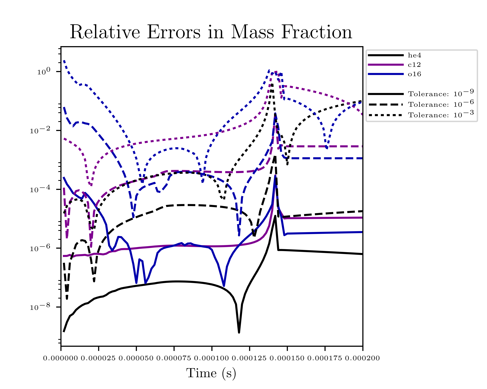

.. _ch:networks:integrators:

*********************
Available Integrators
*********************

We use a high-order implicit ODE solver for integrating the reaction
system.  A few alternatives, including first order implicit and explicit integrators are also
provided.  Internally, the integrators use different data structures
to store the integration progress, and each integrator needs to
provide a routine to convert from the integrator’s internal
representation to the ``burn_t`` type required by the ``actual_rhs``
and ``actual_jac`` routine.

The name of the integrator can be selected at compile time using
the ``INTEGRATOR_DIR`` variable in the makefile. Presently,
the allowed options are:

* ``BackwardEuler``: an implicit first-order accurate backward-Euler
  method.  An error estimate is done by taking 2 half steps and
  comparing to a single full step.  This error is then used to control
  the timestep by using the local truncation error scaling.

* ``ForwardEuler``: an explicit first-order forward-Euler method.  This is
  meant for testing purposes only.  No Jacobian is needed.

* ``QSS``: the quasi-steady-state method of :cite:`mott_qss` (see also
  :cite:`guidry_qss`). This uses a second-order predictor-corrector method,
  and is designed specifically for handling coupled ODE systems for chemical
  and nuclear reactions. However, this integrator has difficulty near NSE,
  so we don't recommend its use in production for nuclear astrophysics.

.. index:: integrator.use_circle_theorem

* ``RKC``: a stabilized explicit Runge-Kutta-Chebyshev integrator based
  on :cite:`sommeijer_rkc_1998`.  This does not require a Jacobian, but
  does need to estimate the spectral radius of the system, which is
  done internally.  This works for moderately stiff problems.

  The spectral radius is estimated by default using the power method,
  built into RKC.  Alternately, by setting ``integrator.use_circle_theorem=1``,
  the `Gershgorin circle theorem <https://en.wikipedia.org/wiki/Gershgorin_circle_theorem>`_
  is used instead.

* ``VODE``: the VODE :cite:`vode` integration package.  We ported this
  integrator to C++ and removed the non-stiff integration code paths.

  .. note::

     The VODE integrator uses Jacobian caching when run on a CPU by default.  This
     can be disabled at runtime by setting ``integrator.use_jacobian_caching = 0``.

     On GPUs, we disable Jacobian caching due to the increased memory
     needs.  Jacobian caching on GPUs can be enabled by explicitly
     setting the build parameter ``USE_JACOBIAN_CACHING=TRUE``.

We recommend that you use the VODE solver, as it is the most
robust.

.. index:: integrator.scale_system

.. important::

   The integrator will not abort if it encounters trouble.  Instead it will
   set ``burn_t burn_state.success = false`` on exit.  It is up to the
   application code to handle the failure.

.. note::

   The runtime parameter ``integrator.scale_system``
   will scale the internal energy that the integrator sees by the initial
   value of :math:`e` to make the system :math:`\mathcal{O}(1)`.  The value
   of ``atol_enuc`` will likewise be scaled.  This works for both Strang
   and simplified-SDC.  For the ``RKC`` integrator, this is enabled by
   default.

   For most integrators this algebraic change should not affect the output
   to more than roundoff, but the option is included to allow for some
   different integration approaches in the future.

   This option currently does not work with the ForwardEuler or QSS integrators.

Tolerances
==========

Tolerances dictate how accurate the ODE solver must be while solving
equations during a simulation.  Typically, the smaller the tolerance
is, the more accurate the results will be.  However, if the tolerance
is too small, the code may run for too long or the ODE solver will
never converge.  In these simulations, ``rtol`` values will set the
relative tolerances and ``atol`` values will set the absolute tolerances
for the ODE solver.  Often, one can find and set these values in an
input file for a simulation.

:numref:`fig:tolerances` shows the results of a simple simulation using the
burn_cell unit test to determine
what tolerances are ideal for simulations.
For this investigation, it was assumed that a run with a tolerance of :math:`10^{-12}`
corresponded to an exact result,
so it is used as the basis for the rest of the tests.
From the figure, one can infer that the :math:`10^{-3}` and :math:`10^{-6}` tolerances
do not yield the most accurate results
because their relative error values are fairly large.
However, the test with a tolerance of :math:`10^{-9}` is accurate
and not so low that it takes incredible amounts of computer time,
so :math:`10^{-9}` should be used as the default tolerance in future simulations.

.. _fig:tolerances:

   Relative error of runs with varying tolerances as compared
   to a run with an ODE tolerance of :math:`10^{-12}`.

The integration tolerances for the burn are controlled by
``rtol_spec`` and  ``rtol_enuc``,
which are the relative error tolerances for
:eq:`eq:spec_integrate` and :eq:`eq:enuc_integrate`,
respectively. There are corresponding
``atol`` parameters for the absolute error tolerances. Note that
not all integrators handle error tolerances the same way—see the
sections below for integrator-specific information.

The absolute error tolerances are set by default
to :math:`10^{-12}` for the species, and a relative tolerance of :math:`10^{-6}`
is used for the temperature and energy.

Controlling Species $\sum_k X_k = 1$
====================================

The ODE integrators don't know about the constraint that

$$\sum_k X_k = 1$$

so this is only going to be preserved to the level that the integrator
tolerances allow.  There are a few parameters that help enforce this
constraint on the intermediate states during the integration.

* ``integrator.renormalize_abundances`` : this controls whether we
  renormalize the abundances so that the mass fractions sum to one
  during a burn.

  This has the positive benefit that in some cases it can prevent the
  integrator from going off to infinity or otherwise go crazy; a
  possible negative benefit is that it may slow down convergence
  because it interferes with the integration scheme. Regardless of
  whether you enable this, we will always ensure that the mass
  fractions stay positive and larger than some floor ``small_x``.

  This option is disabled by default.

* ``integrator.SMALL_X_SAFE`` : this is the floor on the mass fractions.
  The default is ``1.e-30``.

* ``integrator.do_species_clip`` : this enforces that the mass fractions
  all in $[\mathtt{SMALL\_X\_SAFE}, 1.0]$.

  This is enabled by default.

Retry Mechanism
===============

Integration can fail for a number of reasons.  Some of the errors you may see are:

1. Not enough steps allowed (``integrator.ode_max_steps``)

2. The timestep selected by the integrator is too small (comparable to
   roundoff)

3. The final abundances do not sum to 1.

There can be a number of reasons for these failures, including:

* The Jacobian is not accurate enough

  This can lead to issues 1 or 2 above

* The integrator is not appropriate for the thermodynamic conditions

  For example, the RKC integrator may be working too hard, leading to
  issue 1.

* The tolerances you are requesting are too tight

  This can lead to issues 1 or 2 above

* The tolerances (in particular, ``integrator.atol_spec``) are too loose

  This can lead to issue 3 above

* The evolution is entering NSE

  This can lead to issue 1.

The ``integrator()`` function that calls the actual integrator drive for
the choice of integrator allows for a retry if a burn failure was detected.
This is enabled by setting

::

   integrator.use_burn_retry = 1

This will call the same integrator again, restarting from the initial conditions
but with a different choice of tolerances and Jacobian.
The runtime parameters that come into play when doing the retry are:

* ``retry_swap_jacobian`` : do we swap that Jacobian type for the retry (i.e.
  use the numerical Jacobian if we try the analytic Jacobian for the first attempt)

* ``retry_rtol_spec`` : relative tolerance for the species on retry

* ``retry_rtol_enuc`` : relative tolerance for the energy on retry

* ``retry_atol_spec`` : absolute tolerance for the species on retry

* ``retry_atol_enuc`` : absolute tolerance for the energy on retry

.. note::

   If you set any of the retry tolerances to be less than $0$, then
   the original (non-retry) tolerance is used on retry.  The default
   value for all of the retry tolerances is $-1$, which means the same
   tolerances are used on retry unless you override them at runtime.

.. tip::

   Sometimes a simulation runs best if you set
   ``integrator.ode_max_steps`` to a small value (like ``10000``) and
   start with the analytic Jacobian (``integrator.jacobian = 1``) and
   then use the retry mechanism to swap the Jacobian on any zones that fail.

Overriding Parameter Defaults on a Network-by-Network Basis
===========================================================

Any network can override or add to any of the existing runtime
parameters by creating a ``_parameters`` file in the network directory
(e.g., ``networks/triple_alpha_plus_cago/_parameters``). As noted in
:doc:`rp_intro`, the fourth column in the ``_parameter``
file definition is the *priority*. When a duplicate parameter is
encountered by the scripts writing the runtime parameter header files, the value
of the parameter with the highest priority is used. So picking a large
integer value for the priority in a network’s ``_parameter`` file will
ensure that it takes precedence.
