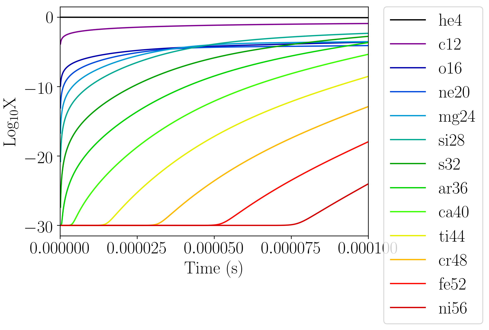

**************
One Zone Tests
**************

There are several tests that let you call the EOS or reaction network
on a single zone to inspect the output directly.

``burn_cell``
=============

``burn_cell`` is a simple one-zone burn that will evolve a state with
a network for a specified amount of time.  This can be used to
understand the timescales involved in a reaction sequence or to
determine the needed ODE tolerances.

Getting Started
---------------

The ``burn_cell`` code are located in
``Microphysics/unit_test/burn_cell``. To run a simulation, ensure that
both an input file and an initial conditions file have been created
and are in the same directory as the executable.

Input File
----------

These files are typically named as ``inputs_burn_network`` where network
is the network you wish to use for your testing.

The structure of this file is is fairly self-explanatory.  The run
prefix defined should be unique to the tests that will be run as they
will be used to identify all of the output files. Typically, the run
prefix involves the name of the network being tested.  The ``atol``
variables define absolute tolerances of the ordinary differential
equations and the ``rtol`` variables define the relative tolerances.  The
second section of the input file collects the inputs that ``main.f90``
asks for so that the user does not have to input all 5+
parameters that are required every time the test is run.  Each input
required is defined and initialized on the lines following
``&cellparams``.  The use of the parameters is show below:

.. table:: The definition of parameters used in the burn_cell unit tests and specified in the second half of each inputs file.

   +-----------------------+----------------------------------------+
   | ``tmax``              | Maximum Time (s)                       |
   +-----------------------+----------------------------------------+
   | ``numsteps``          | Number of time subdivisions            |
   +-----------------------+----------------------------------------+
   | ``density``           | State Density (:math:`\frac{g}{cm^3}`) |
   +-----------------------+----------------------------------------+
   | ``temperature``       | State Temperature (K)                  |
   +-----------------------+----------------------------------------+
   | ``massfractions(i)``  | Mass Fraction for element i            |
   +-----------------------+----------------------------------------+

Running the Code
----------------

To run the code, enter the burn_cell directory and run::

   ./main3d.gnu.ex inputs

where ``inputs`` is the name of your inputs file.

For each of the ``numsteps`` steps defined in the inputs
file, the code will output a files into a new directory titled
``run_prefix_output`` where ``run_prefix`` is the run prefix defined in the
inputs file.  Each output file will be named using the run prefix
defined in the inputs file and the corresponding timestep.

Next, run ``burn_cell.py`` using python 3.x, giving the defined run prefix as an argument.
For example::

    python3 burn_cell.py react_aprox13

The ``burn_cell.py`` code will gather information from all of the
output files and compile them into three graphs explained below.

Graphs Output by ``burn_cell.py``
---------------------------------

The file ``run-prefix_logX.png`` and ``run-prefix_logX.eps`` will display a
graph of the chemical abundances as a function of the time, both on
logarithmic scales, for all species involved in the simulation.  An
example of this graph is shown below.

   An example of a plot output by the burn_cell unit test. This is the
   logX output corresponding to the network aprox13.

The file ``run-prefix_ydot.png`` and ``run-prefix_ydot.eps`` will display the
molar fraction (mass fraction / atomic weight) as a function of time,
both on logarithmic scales, for all species involved in the code.

The file ``run-prefix_T-edot.png`` and ``run-prefix_T-edot.eps`` will display
the temperature and the energy generation rate as a function of time.
